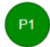
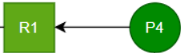
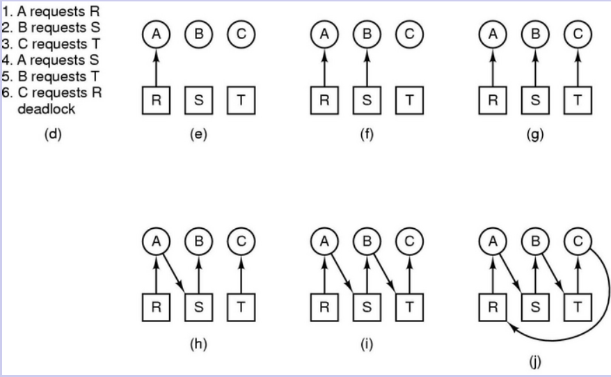

# Betriebsmittelzuteilungsgraphen

sind Graphen, die visualisieren, welche Threads welche Ressourcen belegen bzw. angefordert haben. Dabei können Verklemmungen(Deadlocks) im Falle einer zyklischen Konstellation leicht erkannt werden.

## Bestandteile

| Thread | Ressource | Belegung | Anforderung |
| ------ | --------- | -------- | ----------- |
|    Runde Ecken/Kreis|    Rechteck|  |    Auch als gestrichelter Pfeil möglich|
   
   
   

   
   
   
Je nach Ablauf kann dabei eine zyklische Wartesituation, wie im obigen Beispiel zu sehen, entstehen, die auf einen Deadlock visualisiert.
Beispiel mit 3 Abläufen, 3 Betriebsmitteln und folgendem Aufbau der Abläufe:
   

   
   
| Ausführung mit Deadlock | Ausführung mit Deadlock |
| ----------------------- | ----------------------- |
|  |  |

